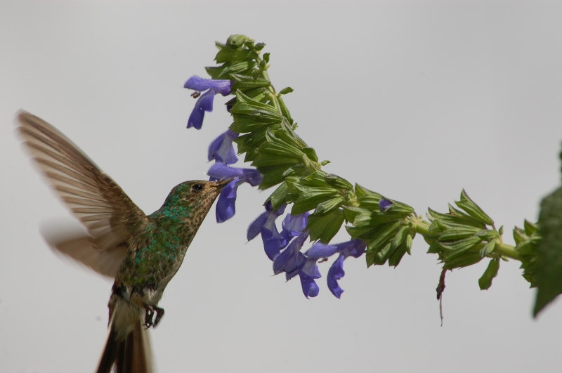

## Ecología y Evolución de las Interacciones Planta - Polinizador

### Del 14 al 18 de octubre de 2019. Sucre, Bolivia.

### Para este curso se requiere la instalación de los softwares [ImageJ](https://imagej.nih.gov/ij/index.html), [R](https://cran.r-project.org/) y [Rstudio](https://rstudio.com/), en sus últimas versiones disponibles, y de los siguientes paquetes de R: *ape*, *devtools*, *geiger* y *phytools*.

### Links a las clases teóricas
[Estrategias Reproductivas en Plantas](https://santiagombv.github.io/ecolevol_polinizacion/teor_estrategias_plantas.html)   
[Comportamiento de los polinizadores](http://santiagombv.github.io/ecolevol_polinizacion/teor_comport_polinizadores.html)    
[Selección Natural](http://santiagombv.github.io/ecolevol_polinizacion/teor_seleccion_natural.html)    
   
### Prácticos
[Selección natural y microevolución. Parte 1](https://santiagombv.github.io/ecolevol_polinizacion/practico_seleccion_1.html)   
[Selección natural y microevolución. Parte 2](https://santiagombv.github.io/ecolevol_polinizacion/practico_seleccion_2.html)    

### Descarga de todo el material práctico [aquí](https://github.com/santiagombv/ecolevol_polinizacion/archive/master.zip)

