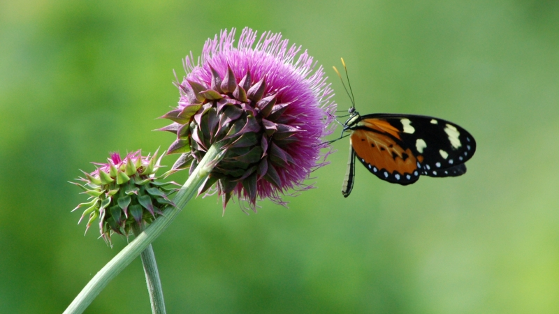

## Ecología y Evolución de las Interacciones Planta - Polinizador

#### **Del 14 al 18 de octubre de 2019.** Universidad Mayor, Real y Pontificia de San Francisco Xavier de Chuquisaca, **Sucre, Bolivia**.

#### Profersores
* Dr. Santiago Benitez-Vieyra. Laboratorio Ecología Evolutiva y Biología Floral – IMBIV (Universidad nacional de Córdoba - CONICET), Argentina.   
* Dr. Federico Sazatornil. Laboratorio Ecología Evolutiva y Biología Floral – IMBIV (Universidad nacional de Córdoba - CONICET), Argentina.   
* Dr. Carlos F. Pinto – Laboratorio de Ecología Química - USFX.   

#### Para este curso se requiere la instalación de los siguientes softwares en sus últimas versiones disponibles:   
[ImageJ](https://imagej.nih.gov/ij/index.html)   
[R](https://cran.r-project.org/)   
[Rstudio](https://rstudio.com/)   
Paquetes de R: *ape*, *devtools*, *geiger* y *phytools*.   

#### Links a las clases teóricas
[Estrategias Reproductivas en Plantas](https://santiagombv.github.io/ecolevol_polinizacion/teor_estrategias_plantas.html)   
[Comportamiento de los polinizadores](http://santiagombv.github.io/ecolevol_polinizacion/teor_comport_polinizadores.html)    
[Selección Natural](http://santiagombv.github.io/ecolevol_polinizacion/teor_seleccion_natural.html)    
   
#### Prácticos
[Selección natural y microevolución. Parte 1](https://santiagombv.github.io/ecolevol_polinizacion/practico_seleccion_1.html)   
[Selección natural y microevolución. Parte 2](https://santiagombv.github.io/ecolevol_polinizacion/practico_seleccion_2.html)    

#### Descarga de todo el material práctico [aquí](https://github.com/santiagombv/ecolevol_polinizacion/archive/master.zip)

