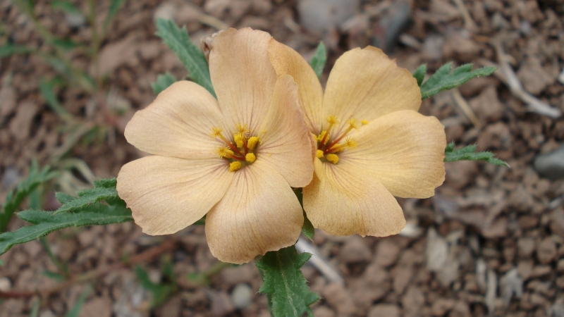

## Parte 2. Toma y análisis de datos.

* Instalar el software ImageJ https://imagej.nih.gov/ij/index.html   
* Se proveen dos sets de imágenes: pétalos y piezas fértiles de 116 individuos de *Turnera sidoides*.
* Discutir las mediciones a realizar sobre las fotos.   
* Utilizando las mediciones obtenidas y estimaciones del éxito reproductivo (granos de polen depositados en el estigma y proporción de fructificación: ver el archivo fitness.csv), estimar gradientes de selección lineal y no lineal para al menos dos rasgos florales de *T. sidoides*.

  